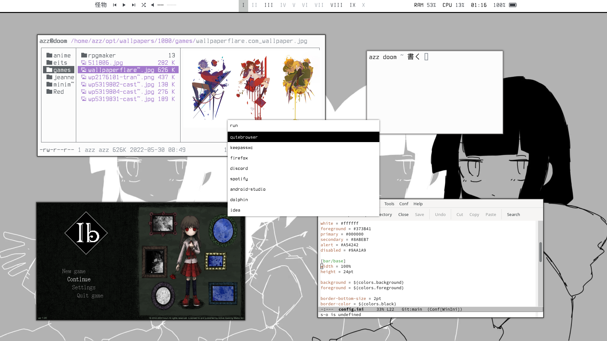
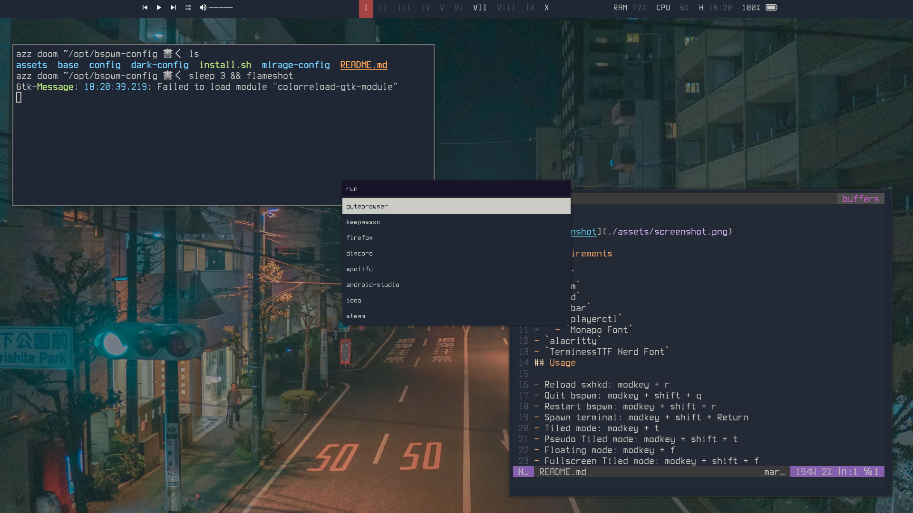

# BSPWM

## Wallpapers

I DO NOT OWN THE WALLPAPERS!!

## Requirements

- `stow`
- `bspwm`
- `sxhkd`
- `polybar`
	- `playerctl`
	- `Monapo Font`
- `alacritty`
- `TerminessTTF Nerd Font`
## Usage

- Reload sxhkd: modkey + r
- Quit bspwm: modkey + shift + q
- Restart bspwm: modkey + shift + r
- Spawn terminal: modkey + shift + Return
- Tiled mode: modkey + t
- Pseudo Tiled mode: modkey + shift + t
- Floating mode: modkey + f
- Fullscreen Tiled mode: modkey + shift + f
- Send a window to desktop: modkey + number
- Send a window to desktop: modkey + number
- Expand window: modkey + shift + {h,j,k,l}
- Make window bigger: modkey + Return
- Focus window: modkey + {h,j,k,l}
- Close window: modkey + shift + c
- Kill window: modkey + c
- Flameshot: super + shift + s
- Rofi: super + p

## Colorscheme

- `Alacritty/Polybar`: [Mix of Ayu Light and Ayu Mirage](https://github.com/ayu-theme/ayu-colors)

## TODO

- `polybar`
	- can't create custom bar to show the music progress
	- `nf-mdi-loop` icon exist but there isn't icon for no-loop
	- `player-ctl shuffle Toggle` isn't working with spotify

